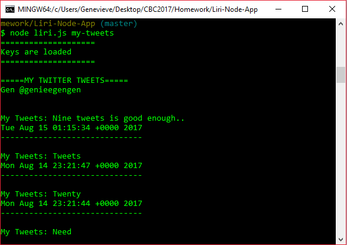
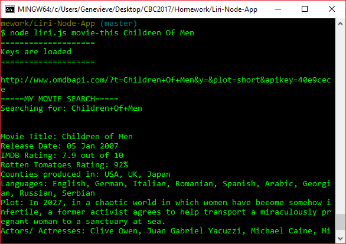
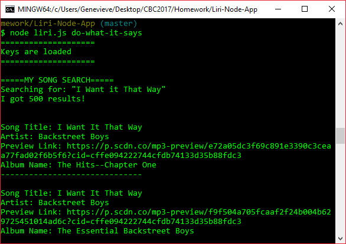

# Liri-Node-App

### Overview

The LIRI (Language Interpretation and Recognition Interface) application is a command line node app that takes in parameters and gives back data.

The data will log onto user's terminal/bash window and output the data to a .txt file  called `log.txt`.

### Instructions
1. Download the zip file/ repository
2. In the terminal/bash, `npm install` to install the packages (Be sure to have NodeJS installed)
3. Test the following commands below

### Commands

1. `node liri.js my-tweets`

   * Shows creators last couple of tweets and when they were created

2. `node liri.js spotify-this-song '<song name here>'`

   * Shows information about the song (artist, name, preview link, and album)

   * Defaulted to "The Sign" by Ace of Base

3. `node liri.js movie-this '<movie name here>'`

   *  Shows information about movie (title, year, rating, language, plot and actors/ actresses)
   This will output the following information to your terminal/bash window:

   * Defaulted to "Mr. Nobody" 

4. `node liri.js do-what-it-says`
   
   * Uses `fs` Node package that takes text inside the random.txt file and uses it to call one of LIRI's command

### APIs/ Node packages Used

   * [Twitter](https://www.npmjs.com/package/twitter)
   
   * [Spotify](https://www.npmjs.com/package/node-spotify-api)
   
   * [Request](https://www.npmjs.com/package/request)
     
   * [OMDB API](http://www.omdbapi.com)

### Technology Used

   * NodeJS
   * npm packages
